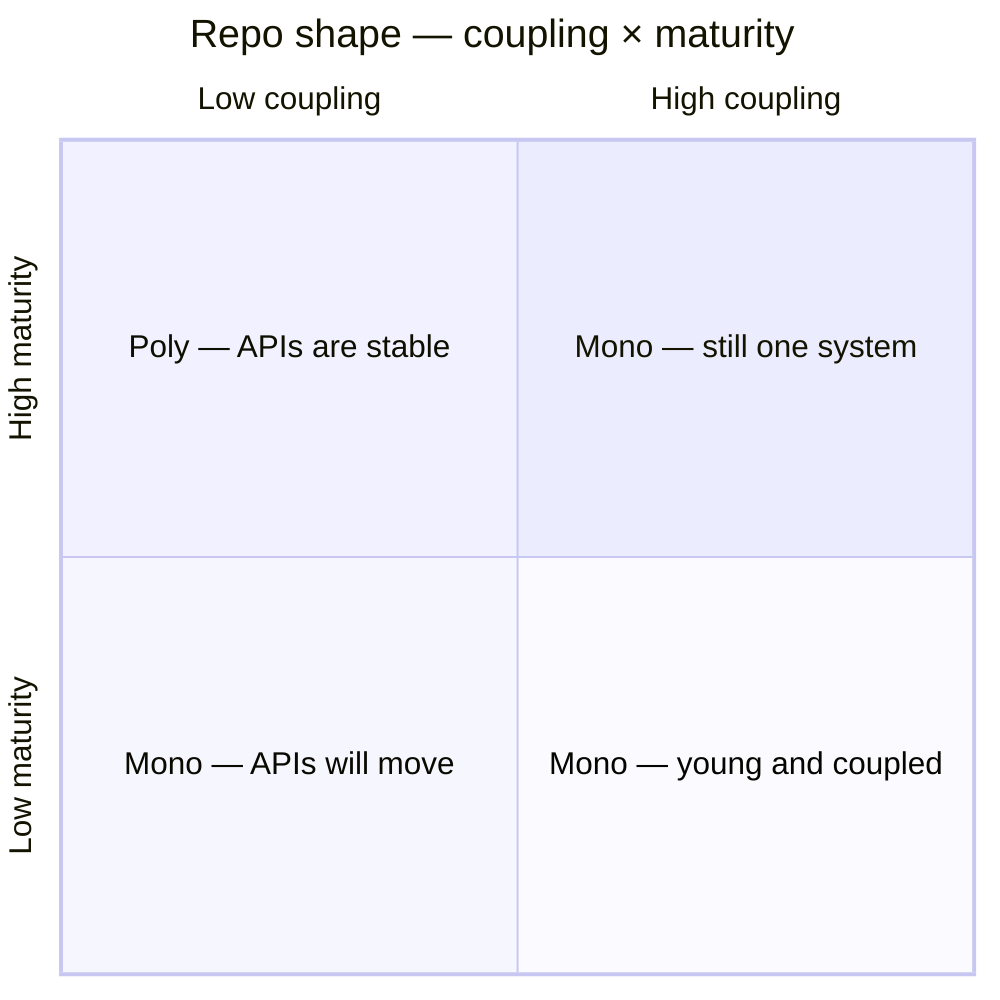

# umbrella

One repository. Many modules. 

Each module ships its own artifacts; the top level just picks them up and releases.

This is a **modular monolith with a packaging layer** — the middle of poly-repo vs mono-repo, for teams that are still maturing.

## Why?
If you:
1. use `git submodule`s as a packaging sytem
1. need multiple PRs into separate repos for one effective change in a deeply coupled system
1. require an engineer to spend multiple days setting up the all the code to start contributing
1. have a complex release process due to the amount of state you need to track and document
Then `umbrella` is for you!

Poly vs mono is two metrics: **coupling** and **maturity**. Poly only wins one cell.



| | **Low coupling** | **High coupling** |
| --- | --- | --- |
| **High maturity** | **Poly.** APIs are stable and you can version them. A product change does not span six repos. Split is cheap. | **Mono.** Mature process is not the same as a separable system. A change in A is still a change in B. |
| **Low maturity** | **Mono.** Decoupling is unproven. Uncoordinated deliveries. Integration pain. | **Mono.** Young and tangled. You need one PR and cheap refactors. |

Umbrella is how you leave the three mono cells without splitting yet: stay in one repo while APIs move, but **package so the modules are actually separate**. The mechanism is CI/CD and packaging, not folder names.

## Poly vs mono

Benefits and costs of both. Neither is free.

| | Poly-repo | Mono-repo |
| --- | --- | --- |
| **Release cadence** | Teams ship on their own clock. Coordinated releases become a meeting and a compatibility matrix. | One train: a single PR can land a cross-cutting change. Fast modules wait on slow ones. |
| **Artifact management** | Natural: one repo → one (or few) artifacts, clear versions. You pay for a registry and “which version talks to which.” | Easy to treat the repo as the artifact. “Deploy main” becomes the product; module versions blur. |
| **Build system mixture** | Each repo picks its toolchain. No shared cache, no shared CI language. | One pipeline wants one way. A second language is a special case or a second-class citizen. |
| **Coupling** | Forced through versioned APIs. Healthy if APIs are stable; brutal if they are not. | Coupling is cheap. Refactors are easy; accidental dependencies are too. Folders are not boundaries. |

## The umbrella

```
each module  →  builds and publishes its own artifacts
```

- The **deliveries are modular.** Each module is a publishable artifact: own build, own version, own pipeline.
- The **top level does not rebuild the world from source.** It consumes what modules already shipped.

Packaging is the boundary. Folders are not. That is what makes this a modular monolith instead of a mono with extra YAML.

## When you need this

You are still maturing. APIs move. Modules still couple. You want independent artifacts *before* you split repos — so splitting later is a publish-target change, not a rewrite.

## When you don't

You are already mature and APIs are stable. You do not need this. Poly-repo (or a boring mono with no packaging theater) is fine.
